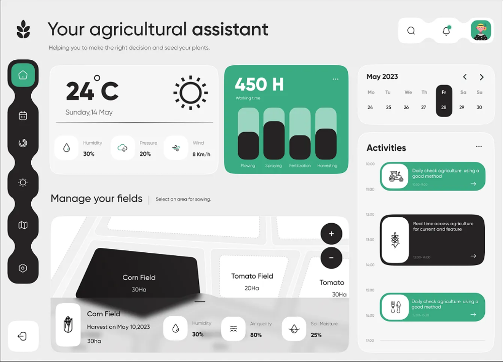

# SPEC-structure.md — GestSilo Pro: Refatoração de Design & UX

**Status:** Phase 2 — Technical Specification ✅  
**Data:** 2026-04-14  
**Baseado em:** PRD-structure.md (Fase 1 Completa)  
**Referência Visual:** `docs/design-reference.png` — Dashboard Agrícola Moderno  
**Próxima Fase:** Implementação (Code)

---

## 1. RESUMO EXECUTIVO

Esta especificação técnica transforma cada descoberta do PRD-structure.md em instruções de código acionáveis, prontas para implementação imediata.

### Problemas a Resolver (Impacto)

| Categoria | Problema | Severidade | Impacto | Esforço |
|-----------|----------|-----------|--------|---------|
| **UX** | Breadcrumbs mostram UUIDs | 🔴 Crítica | Navegação confusa | Médio (2h) |
| **Design** | Cores hardcoded em dashboard | 🔴 Crítica | Viola design system | Baixo (30m) |
| **A11y** | Tabs hit area pequena | 🔴 Crítica | Inacessível em mobile | Baixo (15m) |
| **Responsividade** | Dialog width fixo | 🟡 Importante | Quebra em mobile | Baixo (20m) |
| **Design** | Border-radius inconsistente | 🟡 Importante | Falta coesão visual | Baixo (20m) |
| **Responsividade** | Tabelas sem scroll | 🟡 Importante | Horizontal overflow em mobile | Baixo (15m) |
| **A11y** | Forms sem aria-describedby | 🟡 Importante | Acessibilidade ruim | Médio (1h) |

### Esforço Total Estimado

- **FASE 1 (Crítica):** 4 horas (breadcrumbs, cores, tabs, dialog)
- **FASE 2 (Importante):** 2 horas (padronização, scroll, forms)
- **FASE 3 (Polish):** 3 horas (tooltips, indicadores, error boundaries)
- **Total:** ~9 horas de trabalho

---

## 1.1 REFERÊNCIA VISUAL: Dashboard Agrícola Moderno

A imagem de referência (`docs/design-reference.png`) define o padrão visual final esperado para GestSilo Pro.



*Figura: Dashboard moderno com sidebar escura, cards brancos, números grandes, paleta verde + cinza + branco*

### Análise de Design da Referência

#### 🎨 **Paleta de Cores**

| Elemento | Cor | Uso | Token CSS |
|----------|-----|-----|-----------|
| **Primária (Verde)** | #00B366 aprox. | Botões, accents, dados principais | `--primary` |
| **Fundo Light** | #F5F5F5 / #FFFFFF | Page background, cards | `--background` / `--card` |
| **Fundo Dark** | #1A1A1A / #2A2A2A | Sidebar, dark mode | `--sidebar` |
| **Texto Principal** | #1A1A1A | Headings, labels | `--foreground` |
| **Texto Muted** | #666666 / #999999 | Helper text, secondary | `--muted-foreground` |

#### 📐 **Tipografia & Hierarquia**

- **Números grandes** (24°C, 450 H): `text-4xl font-bold` — Destaque máximo
- **Labels pequenos** ("Currently in Poly"): `text-xs text-muted-foreground`
- **Títulos de seção** ("Manage your fields"): `text-lg font-semibold`
- **Card titles** ("Corn Field"): `text-sm font-medium`

#### 📦 **Componentes Visuais**

1. **Sidebar** — Vertical, ícones redondos em pill-shape (`rounded-full`), fundo escuro, espaçamento arejado
2. **Cards** — Sem bordas, sombra sutil (`shadow-sm`), `rounded-2xl`, padding generoso (`p-6`)
3. **Cards de Destaque** — Verde primário, texto branco, números grandes (ex: "450 H")
4. **Buttons** — Circulares com ícone (icon buttons), sombra discreta
5. **Inputs/Selects** — Borda sutil, fundo muted, `rounded-lg`

#### 🎭 **Princípios de Layout**

1. **Espaço em branco generoso** — Muito respiro entre elementos
2. **Minimalismo funcional** — Cada card exibe UMA informação principal
3. **Paleta restrita** — Verde, preto, cinza, branco (sem cores competindo)
4. **Ênfase visual** — Números grandes em verde para dados críticos
5. **Sidebar minimalista** — Ícones como padrão (não texto visível quando colapsado)
6. **Sem gradientes chamativos** — Apenas cores sólidas e sombras

#### ✅ **O que o GestSilo Pro DEVE ter (Baseado na Referência)**

```
✅ Verde primário vibrante (#00A651 atual está OK, manter)
✅ Sidebar dark com ícones pills (já tem em components/Sidebar.tsx)
✅ Cards brancos com sombra sutil (já implementado)
✅ Espaçamento arejado entre elementos
✅ Números grandes (text-3xl/4xl) para dados principais
✅ Labels pequenos (text-xs) para contexto
✅ Sem bordas aparentes em cards (shadow-sm sim)
✅ Minimalismo — uma informação por card
```

#### ❌ **O que o GestSilo Pro NÃO DEVE ter**

```
❌ Múltiplas cores competindo
❌ Gradientes chamativos ou decorativos
❌ Padding apertado (tudo deve respirar)
❌ Bordas grossas em cards
❌ Muitos elementos em um card
❌ Texto pequeno amontoado
❌ Sidebar com muito conteúdo visível
```

---

## 2. DEFINIÇÕES DO DESIGN SYSTEM (Padrão Definitivo)

### 2.0 Sidebar & Navegação (Referência Visual)

A imagem de referência mostra um sidebar vertical à esquerda com:
- Fundo escuro (`--sidebar` / `#1A1A1A` aprox.)
- Ícones circulares (`rounded-full`)
- Espaçamento arejado entre items
- Ícone ativo destacado em verde (primary)
- Sem labels visíveis (apenas ícones — muito minimalista)

**Aplicação em GestSilo Pro:**

```tsx
// Sidebar item padrão (expandido):
<SidebarItem
  className="px-3 py-2.5 rounded-xl hover:bg-sidebar-accent"
>
  <Icon className="w-5 h-5 text-sidebar-foreground" />
  <span className="text-sm text-sidebar-foreground">Label</span>
</SidebarItem>

// Sidebar item ativo:
<SidebarItem
  className="px-3 py-2.5 rounded-lg bg-primary/20 border-l-2 border-primary"
  aria-current="page"
>
  <Icon className="w-5 h-5 text-primary" />
  <span className="text-sm text-primary font-medium">Label Ativo</span>
</SidebarItem>

// Sidebar colapsado:
// Mostrar apenas ícone com rounded-lg ou rounded-xl
```

**Cores para Sidebar:**

| Estado | Background | Foreground | Border |
|--------|-----------|-----------|--------|
| Normal | `bg-sidebar` | `text-sidebar-foreground` | — |
| Hover | `hover:bg-sidebar-accent` | — | — |
| Ativo | `bg-primary/20` | `text-primary` | `border-l-primary` |


### 2.1 Border-Radius

Padrão ÚNICO e obrigatório em toda a aplicação:

```css
/* Token base em app/globals.css */
--radius: 0.625rem;  /* 10px — base */

/* Mapeamento a usar em TailwindCSS (via @theme inline): */
--radius-sm: calc(var(--radius) * 0.6);    /* 6px — badges, pills pequenas */
--radius-md: calc(var(--radius) * 0.8);    /* 8px — inputs, buttons pequenos */
--radius-lg: var(--radius);                /* 10px — inputs, buttons padrão */
--radius-xl: calc(var(--radius) * 1.4);    /* 14px — inputs grandes, buttons, dropdowns */
--radius-2xl: calc(var(--radius) * 1.8);   /* 18px — cards, dialogs */
```

**Mapeamento Tailwind (classes a usar):**

| Componente | Classe | Valor | Onde |
|-----------|--------|-------|------|
| **Cards (no dashboard)** | `rounded-2xl` | 18px | Dashboard, listas de cards |
| **Cards (no detalhe)** | `rounded-xl` | 14px | Cards internos, resumos |
| **Inputs/Selects** | `rounded-lg` | 10px | Formulários |
| **Buttons padrão** | `rounded-lg` | 10px | Buttons normais |
| **Buttons "icon"** | `rounded-lg` | 10px | Buttons icon |
| **Badges/Pills** | `rounded-full` | 50% | Badges de status, pills |
| **Dialogs** | `rounded-xl` | 14px | Modal content |
| **Dropdowns/Popovers** | `rounded-xl` | 14px | Menu dropdowns |

**Regra:** Se não está na tabela acima, usar `rounded-lg` como padrão.

### 2.2 Spacing (Escala Consistente)

Valores OBRIGATÓRIOS a usar em toda a aplicação:

```css
/* Padding interno em cards */
p-4      → 16px (cards em listas, cards pequenos)
p-6      → 24px (cards padrão, page wrappers)
p-8      → 32px (page layout principal)

/* Gap entre elementos */
gap-2    → 8px (elementos muito próximos)
gap-3    → 12px (elementos próximos)
gap-4    → 16px (gap padrão entre cards, elementos)
gap-6    → 24px (gap entre seções principais)
gap-8    → 32px (gap entre seções grandes)

/* Margin utilities */
mt-2, mb-2, my-2  → 8px (margin pequeno)
mt-4, mb-4, my-4  → 16px (margin padrão)
mt-6, mb-6, my-6  → 24px (margin entre seções)
mt-8, mb-8, my-8  → 32px (margin grande)
```

**Regra:** Não usar valores intermediários (`p-5`, `gap-5`, etc.) — apenas valores na escala acima.

**Aplicação:**

| Localização | Padding | Gap | Exemplo |
|------------|---------|-----|---------|
| Page wrapper | `p-6 md:p-8` | — | `<main className="p-6 md:p-8">` |
| Card content | `p-4` ou `p-6` | — | `<CardContent className="p-6">` |
| Section wrapper | — | `gap-6` | `<section className="space-y-6">` |
| Grid de cards | — | `gap-4` | `<div className="grid gap-4">` |
| Between h2 & content | — | `gap-4` | Título + conteúdo |

### 2.3 Tipografia (Hierarquia)

**Tamanhos definitivos:**

```
Página / Section heading:    text-4xl md:text-4xl font-bold (H1)
Subsection heading:          text-2xl font-bold (H2)
Card/Dialog heading:         text-xl font-semibold (H3)
Label/Button text:           text-sm font-medium
Helper text/description:     text-xs text-muted-foreground
```

**Aplicação:**

- **Dashboard main heading:** `className="text-4xl font-bold text-foreground"`
- **Card titles:** `className="text-sm font-semibold text-foreground"`
- **Section titles (ex: "Atividades Recentes"):** `className="text-xl font-bold text-foreground"`
- **Form labels:** `className="text-sm font-medium text-foreground"`
- **Help text:** `className="text-xs text-muted-foreground"`

### 2.4 Cores e Tokens CSS

**Estratégia de cores alinhada com Referência Visual:**

A imagem de referência usa:
- Verde vibrante como cor primária (matches `--primary` current)
- Fundo branco/cinza claro muito limpo
- Sidebar escura com icons verdes
- Mínimas cores secundárias (apenas green + gray + black/white)

**Tokens disponíveis (definidos em `app/globals.css`):**

| Token | Light Mode | Dark Mode | Uso | Referência |
|-------|-----------|----------|-----|-----------|
| `--primary` | oklch(0.50 0.12 145) | oklch(0.65 0.25 150) | Verde primário, botões, accents | Verde vibrante da imagem |
| `--secondary` | oklch(0.65 0.12 70) | oklch(0.70 0.15 70) | Âmbar/secundário (card data) | Dados secundários |
| `--muted` | oklch(0.92 0.03 85) | oklch(0.25 0.015 145) | Backgrounds neutros, disabled | Fundo cinza da imagem |
| `--status-success` | oklch(0.50 0.15 150) | oklch(0.65 0.20 150) | Status OK, checkmarks | Green = success |
| `--status-warning` | oklch(0.65 0.12 70) | oklch(0.70 0.15 70) | Alertas, warnings | Yellow/amber |
| `--status-danger` | oklch(0.55 0.15 25) | oklch(0.65 0.20 25) | Erros, destructivo | Red |
| `--status-info` | oklch(0.50 0.12 280) | oklch(0.65 0.20 280) | Informativo, cyan/azul | Blue info |

**Constraint importante:** 
- ✅ Usar principalmente `--primary` (verde) + `--muted` (cinza)
- ✅ Limitar `--secondary` para dados específicos
- ❌ Não misturar múltiplas cores no mesmo card
- ❌ Não usar cores muito dessaturadas ou muito vibrantes demais

**Mapeamento Tailwind (classes a usar):**

```typescript
// ❌ NUNCA use hardcoded:
className="text-[#10B981]"    // Hardcoded verde
className="bg-[#0284C7]/10"   // Hardcoded azul
className="text-[#0099FF]"    // Qualquer cor hexadecimal

// ✅ SEMPRE use tokens CSS:
className="text-primary"      // Verde primário
className="text-secondary"    // Âmbar/secundário
className="text-status-info"  // Azul/Cyan
className="text-status-success" // Verde success
className="text-muted-foreground" // Texto muted

// ✅ Com opacidade:
className="bg-primary/10"     // Background com opacidade
className="text-primary/60"   // Text com opacidade
className="border-l-primary/50" // Border com opacidade
```

**Decisão de Tokens (ALINHADO COM REFERÊNCIA VISUAL):**

A imagem mostra cards com verde primário como destaque. Adaptar assim:

| Card | Padrão | Token | Exemplo na Referência |
|------|--------|-------|----------------------|
| **Silos** (ocupação) | Card branco + icon verde | `text-primary` + `bg-primary/10` | Data card simples |
| **Talhões** | Card branco + icon âmbar | `text-secondary` + `bg-secondary/10` | Data card simples |
| **Frota** | Card branco + icon azul | `text-status-info` + `bg-status-info/10` | Data card simples |
| **Financeiro** | Card branco + icon verde | `text-primary` + `bg-primary/10` | Data card simples |
| **Card destaque** | Fundo verde + text branco | `bg-primary` + `text-primary-foreground` | "450 H" card |
| **Status badges** | Verde ou vermelho | `text-status-success` ou `text-status-danger` | — |

**Constraint importante (NOVO):**
- ✅ Máximo 2-3 cores por página (verde primário + 1 secundária)
- ✅ Icon em cor, número/label em preto/cinza
- ✅ Cards de destaque podem ter fundo verde inteiro
- ✅ Cards informativos são brancos com ícone colorido
- ❌ Não misturar múltiplas cores de status no mesmo espaço
- ❌ Não usar cores para simples diferenciação (usar layout/tipografia)

### 2.5 Elevação / Sombras

```css
/* Tokens em app/globals.css */
--shadow-sm: 0 1px 2px 0 rgb(0 0 0 / 0.05);        /* Subtle — cards padrão */
--shadow-md: 0 4px 6px -1px rgb(0 0 0 / 0.1);      /* Default */
--shadow-lg: 0 10px 15px -3px rgb(0 0 0 / 0.1);    /* Raised — hover effect */
--shadow-xl: 0 20px 25px -5px rgb(0 0 0 / 0.1);    /* Floating — modais */
```

**Uso (baseado na Referência Visual):**

| Componente | Shadow | Hover Shadow | Exemplo | Referência |
|-----------|--------|--------------|---------|-----------|
| Cards padrão | `shadow-sm` | `hover:shadow-md` | Dashboard cards, listas | Cards brancos na imagem |
| Cards de destaque | `shadow-sm` | `hover:shadow-md` | Green data cards (450 H) | Cards verdes com dados |
| Floating elements | `shadow-md` | — | Buttons circulares | Icon buttons da imagem |
| Dropdowns/Menus | `shadow-lg` | — | Dropdown menus, popovers | Menus flutuantes |
| Modais | `shadow-xl` | — | Dialogs, alerts modais | Não há na imagem |

**Regra:** Sombras são SUUUUTIS (subtle). A referência não usa sombras pesadas.

---

## 2.6 Padrão Visual de Cards (Inspirado na Referência)

A imagem mostra dois padrões principais de cards:

### Padrão 1: Card de Dado Principal (ex: "450 H")

```tsx
// ✅ CORRETO (como na imagem):
<Card className="bg-primary rounded-2xl p-6 shadow-sm">
  <CardContent>
    <p className="text-xs text-primary/60 mb-2">Label</p>
    <p className="text-4xl font-bold text-primary-foreground">450</p>
    <p className="text-sm text-primary-foreground/80 mt-1">Hours</p>
  </CardContent>
</Card>

// Resultado: Card verde com texto grande e branco
```

### Padrão 2: Card de Informação (ex: "24°C")

```tsx
// ✅ CORRETO (como na imagem):
<Card className="bg-card rounded-2xl p-6 shadow-sm">
  <CardContent>
    <div className="flex items-center justify-between">
      <div>
        <p className="text-4xl font-bold text-foreground">24°C</p>
        <p className="text-xs text-muted-foreground mt-1">Currently in Poly</p>
      </div>
      <IconComponent className="w-8 h-8 text-primary" />
    </div>
  </CardContent>
</Card>

// Resultado: Card branco com número grande, label pequeno, ícone verde
```

### Padrão 3: Card com Conteúdo Complexo (ex: Fields)

```tsx
// ✅ CORRETO (como na imagem):
<Card className="bg-card rounded-2xl p-6 shadow-sm">
  <CardHeader>
    <h3 className="text-sm font-semibold text-foreground">Manage your fields</h3>
  </CardHeader>
  <CardContent className="space-y-4">
    {/* List of fields with minimal visual */}
  </CardContent>
</Card>

// Resultado: Card branco com title pequeno, conteúdo espaçado
```

---

## 3. FASE 1 — CORREÇÕES CRÍTICAS

### 3.1 Breadcrumbs [BR1, BR2, BR3, BR4]

**Problema:** UUIDs aparecem em breadcrumbs em vez de nomes amigáveis. Ex: `Home > silos > f07d1f6c-9486...` deveria ser `Home > Silos > Silo 01`

**Arquivos a CRIAR:**

#### 3.1.1 `hooks/useBreadcrumbData.ts`

```typescript
'use client';

import { useEffect, useState } from 'react';
import { usePathname } from 'next/navigation';
import { supabase } from '@/lib/supabase';
import { useAuth } from '@/hooks/useAuth';

/**
 * Tipagem para dados de breadcrumb
 */
export interface BreadcrumbSegment {
  label: string;
  href: string;
  id?: string;
  isLoading?: boolean;
}

/**
 * Hook para buscar dados dinâmicos de breadcrumb
 * 
 * Estratégia:
 * - Analisa o pathname para determinar a rota
 * - Busca nomes amigáveis no Supabase quando necessário
 * - Implementa cache simples (evita re-fetch)
 * - Retorna array de segmentos com label, href e id
 * 
 * Exemplo:
 *   /dashboard → [{ label: "Dashboard", href: "/dashboard" }]
 *   /dashboard/silos → [{ label: "Silos", href: "/dashboard/silos" }]
 *   /dashboard/silos/uuid → [{ label: "Silos", href: "/dashboard/silos" }, { label: "Silo 01", href: "/dashboard/silos/uuid" }]
 *   /dashboard/silos/uuid/movimentacoes → [{ label: "Silos", ... }, { label: "Silo 01", ... }, { label: "Movimentações", ... }]
 */
export function useBreadcrumbData(): BreadcrumbSegment[] {
  const pathname = usePathname();
  const { fazendaId } = useAuth();
  const [segments, setSegments] = useState<BreadcrumbSegment[]>([]);

  useEffect(() => {
    const generateBreadcrumbs = async () => {
      const parts = pathname.split('/').filter(Boolean);
      
      if (parts.length === 0) {
        setSegments([]);
        return;
      }

      const breadcrumbs: BreadcrumbSegment[] = [];
      let currentPath = '';

      for (let i = 0; i < parts.length; i++) {
        const part = parts[i];
        currentPath += `/${part}`;

        // Skip 'dashboard' como breadcrumb (já mostrado como Home)
        if (part === 'dashboard') {
          continue;
        }

        // Detectar se é um UUID (padrão: 8-4-4-4-12 caracteres hexadecimais)
        const isUuid = /^[0-9a-f]{8}-[0-9a-f]{4}-[0-9a-f]{4}-[0-9a-f]{4}-[0-9a-f]{12}$/i.test(part);

        if (isUuid) {
          // Tentar buscar nome do registro no banco
          const nome = await fetchNameForId(part, parts[i - 1], fazendaId);
          breadcrumbs.push({
            label: nome || part, // Fallback ao UUID se não encontrar
            href: currentPath,
            id: part,
            isLoading: !nome,
          });
        } else {
          // É um módulo (silos, talhoes, frota, etc.)
          breadcrumbs.push({
            label: part,
            href: currentPath,
          });
        }
      }

      setSegments(breadcrumbs);
    };

    generateBreadcrumbs();
  }, [pathname, fazendaId]);

  return segments;
}

/**
 * Busca nome amigável para um ID (UUID)
 * Mapeia a tabela correta baseado no segmento anterior
 */
async function fetchNameForId(
  id: string,
  context: string,
  fazendaId: string | null
): Promise<string | null> {
  if (!fazendaId) return null;

  try {
    // Mapeamento: contexto (rota anterior) → tabela + campo de nome
    const tableMap: Record<string, { table: string; nameField: string }> = {
      silos: { table: 'silos', nameField: 'nome' },
      talhoes: { table: 'talhoes', nameField: 'nome' },
      frota: { table: 'maquinas', nameField: 'nome' }, // ou identificador
      rebanho: { table: 'rebanho', nameField: 'nome' },
      insumos: { table: 'insumos', nameField: 'nome' },
      financeiro: { table: 'financeiro', nameField: 'descricao' },
      // Adicionar mais conforme necessário
    };

    const config = tableMap[context];
    if (!config) {
      // Se não souber o contexto, não buscar
      return null;
    }

    const { data, error } = await supabase
      .from(config.table)
      .select(config.nameField)
      .eq('id', id)
      .eq('fazenda_id', fazendaId)
      .single();

    if (error || !data) {
      console.warn(`[Breadcrumb] Não encontrado: ${context}/${id}`, error);
      return null;
    }

    return data[config.nameField] || null;
  } catch (err) {
    console.error('[Breadcrumb] Erro ao buscar nome:', err);
    return null;
  }
}
```

**Considerações:**

- Cache: Implementação simples. Se necessário, adicionar React Query ou SWR para cache mais robusto
- Edge cases: Se tabela não existir ou field não existir, fallback ao UUID
- RLS: Query inclui `eq('fazenda_id', fazendaId)` para garantir segurança
- Loading state: Campo `isLoading` pode ser usado para mostrar skeleton

#### 3.1.2 `lib/breadcrumb-formatter.ts`

```typescript
/**
 * Formata labels de breadcrumb a partir de slugs
 * 
 * Transforma:
 *   "silos" → "Silos"
 *   "talhoes" → "Talhões"
 *   "frota" → "Frota"
 *   "maquina-details" → "Detalhes da Máquina"
 *   "manutenção" → "Manutenção"
 */

// Mapeamento de slugs conhecidos → labels amigáveis
const SLUG_MAP: Record<string, string> = {
  'silos': 'Silos',
  'talhoes': 'Talhões',
  'frota': 'Frota',
  'financeiro': 'Financeiro',
  'rebanho': 'Rebanho',
  'insumos': 'Insumos',
  'calculadoras': 'Calculadoras',
  'relatorios': 'Relatórios',
  'configuracoes': 'Configurações',
  'onboarding': 'Onboarding',
  'movimentacoes': 'Movimentações',
  'estoque': 'Estoque',
  'qualidade': 'Qualidade',
  'manutencoes': 'Manutenções',
  'manutenção': 'Manutenção',
  'historico': 'Histórico',
  'perfil': 'Perfil',
  'fazenda': 'Fazenda',
  'usuarios': 'Usuários',
};

export function formatBreadcrumbLabel(slug: string): string {
  // Se existe mapeamento, usar
  if (SLUG_MAP[slug.toLowerCase()]) {
    return SLUG_MAP[slug.toLowerCase()];
  }

  // Caso contrário, converter kebab-case e camelCase para Title Case
  return slug
    .replace(/[-_]/g, ' ')           // Trocar - e _ por espaço
    .replace(/([a-z])([A-Z])/g, '$1 $2') // Separar camelCase
    .split(' ')
    .map(word => word.charAt(0).toUpperCase() + word.slice(1).toLowerCase())
    .join(' ');
}

/**
 * Alias mais legível
 */
export const labelizer = formatBreadcrumbLabel;
```

**Arquivos a MODIFICAR:**

#### 3.1.3 `components/Breadcrumbs.tsx` (ANTES → DEPOIS)

**ANTES:**
```typescript
'use client';

import Link from 'next/link';
import { usePathname } from 'next/navigation';
import { ChevronRight, Home } from 'lucide-react';
import { cn } from '@/lib/utils';

export function Breadcrumbs() {
  const pathname = usePathname();
  const segments = pathname.split('/').filter(Boolean);

  return (
    <nav className="flex items-center space-x-1 text-sm text-muted-foreground mb-6">
      <Link
        href="/dashboard"
        className="flex items-center hover:text-foreground transition-colors"
      >
        <Home className="h-4 w-4" />
      </Link>
      {segments.map((segment, index) => {
        const href = `/${segments.slice(0, index + 1).join('/')}`;
        const isLast = index === segments.length - 1;
        const label = segment.charAt(0).toUpperCase() + segment.slice(1);

        if (segment === 'dashboard' && index === 0) return null;

        return (
          <div key={href} className="flex items-center">
            <ChevronRight className="h-4 w-4 mx-1" />
            <Link
              href={href}
              className={cn(
                "hover:text-foreground transition-colors",
                isLast && "font-semibold text-foreground pointer-events-none"
              )}
            >
              {label}
            </Link>
          </div>
        );
      })}
    </nav>
  );
}
```

**DEPOIS:**
```typescript
'use client';

import Link from 'next/link';
import { ChevronRight, Home } from 'lucide-react';
import { cn } from '@/lib/utils';
import { useBreadcrumbData, type BreadcrumbSegment } from '@/hooks/useBreadcrumbData';
import { formatBreadcrumbLabel } from '@/lib/breadcrumb-formatter';
import { Skeleton } from '@/components/ui/skeleton';

export function Breadcrumbs() {
  const segments = useBreadcrumbData();

  if (segments.length === 0) {
    return null; // Não mostrar breadcrumb se estiver vazio
  }

  return (
    <nav
      className="flex items-center gap-2 text-sm text-muted-foreground overflow-x-auto pb-2 mb-4"
      aria-label="Navegação por breadcrumb"
    >
      {/* Home */}
      <Link
        href="/dashboard"
        className="flex items-center hover:text-foreground transition-colors flex-shrink-0"
        aria-label="Voltar ao Dashboard"
      >
        <Home className="h-4 w-4" />
      </Link>

      {/* Segmentos dinâmicos */}
      {segments.map((segment: BreadcrumbSegment, index: number) => {
        const isLast = index === segments.length - 1;
        const label = segment.label;

        return (
          <div key={segment.href} className="flex items-center gap-2 flex-shrink-0">
            <ChevronRight className="h-4 w-4 text-muted-foreground/50" aria-hidden="true" />
            
            {segment.isLoading ? (
              // Skeleton enquanto busca o nome
              <Skeleton className="h-4 w-20" />
            ) : (
              <Link
                href={segment.href}
                className={cn(
                  "hover:text-foreground transition-colors whitespace-nowrap",
                  isLast && "font-semibold text-foreground pointer-events-none"
                )}
                aria-current={isLast ? 'page' : undefined}
              >
                {/* Truncar texto longo com ellipsis */}
                <span className="max-w-[120px] truncate inline-block">
                  {label}
                </span>
              </Link>
            )}
          </div>
        );
      })}
    </nav>
  );
}
```

**Mudanças principais:**

- Usa `useBreadcrumbData()` em vez de fazer parsing manual
- Mostra Skeleton enquanto busca nomes (loading state)
- Suporta ellipsis para textos longos (`max-w-[120px] truncate`)
- Melhora responsividade em mobile (`overflow-x-auto`)
- Adiciona aria-labels para acessibilidade

#### 3.1.4 `components/Header.tsx` (INTEGRAÇÃO)

**Modificação:** Integrar Breadcrumbs dentro do Header

**Linha 104-229 — MUDANÇA IMPORTANTE:**

Adicionar Breadcrumbs logo abaixo do header (depois do Menu Mobile):

```typescript
// Linha ~121 (depois do SheetContent do mobile menu):

{/* Breadcrumbs — Desktop e Mobile */}
<div className="absolute left-0 right-0 top-14 px-4 bg-background/95 dark:bg-sidebar/80 backdrop-blur-sm border-b border-border md:relative md:top-auto md:bg-transparent dark:md:bg-transparent md:border-b-0 md:px-0 md:mr-4">
  <Breadcrumbs />
</div>

{/* Área direita (Theme + User) */}
<div className="flex w-full justify-end items-center gap-x-4">
  {/* ... resto do código ... */}
</div>
```

**Explicação:**

- Em mobile: breadcrumb fica logo abaixo do header em uma linha adicional (com bg semi-transparente)
- Em desktop: breadcrumb fica integrado no header (antes dos controles de tema)
- Uso de `absolute` + `relative` para layout responsivo

**Alternativa (se quiser breadcrumb SEMPRE no header):**

```typescript
{/* Breadcrumbs — inline no header */}
<div className="flex-1 ml-4 hidden md:flex items-center">
  <Breadcrumbs />
</div>

{/* Área direita */}
<div className="flex justify-end items-center gap-x-4">
  {/* ... */}
</div>
```

**Remoção de Breadcrumbs anterior:**

Em `app/dashboard/layout.tsx` (ou onde Breadcrumbs era renderizado antes), remover a linha:
```typescript
// ❌ REMOVER se estava aqui:
{/* <Breadcrumbs /> */}
```

### 3.2 Cores Hardcoded [CO1, CO2, CO3]

**Problema:** `app/dashboard/page.tsx` tem cores hardcoded que não respeitam dark/light mode

**Arquivo a MODIFICAR:** `app/dashboard/page.tsx`

#### Linhas com cores hardcoded:

```typescript
// Linha 206-209: Card "Talhões"
color: 'text-[#10B981]',      // ❌ Hardcoded verde
bg: 'bg-[#10B981]/10',        // ❌ Hardcoded verde com opacidade

// Linha 217-219: Card "Frota"
color: 'text-[#0284C7]',      // ❌ Hardcoded azul ciano
bg: 'bg-[#0284C7]/10',        // ❌ Hardcoded azul com opacidade
```

#### MUDANÇA — Substituir linhas 206-209:

**ANTES:**
```typescript
{
  title: 'Área em Cultivo',
  value: stats?.talhaoArea ?? '—',
  detail: talhoesDetail(stats),
  icon: Map,
  iconLabel: 'Ícone de talhões',
  color: 'text-[#10B981]',
  bg: 'bg-[#10B981]/10',
  borderColor: 'border-l-[#10B981]',
  href: '/dashboard/talhoes',
},
```

**DEPOIS:**
```typescript
{
  title: 'Área em Cultivo',
  value: stats?.talhaoArea ?? '—',
  detail: talhoesDetail(stats),
  icon: Map,
  iconLabel: 'Ícone de talhões',
  color: 'text-secondary',        // ✅ Usa token CSS
  bg: 'bg-secondary/10',          // ✅ Usa token CSS
  borderColor: 'border-l-secondary', // ✅ Usa token CSS
  href: '/dashboard/talhoes',
},
```

#### MUDANÇA — Substituir linhas 217-219:

**ANTES:**
```typescript
{
  title: 'Frota em Operação',
  value: stats?.maquinasTotal ?? '—',
  detail: stats?.maquinasDetalhe ?? '—',
  icon: Truck,
  iconLabel: 'Ícone de frota',
  color: 'text-[#0284C7]',
  bg: 'bg-[#0284C7]/10',
  borderColor: 'border-l-[#0284C7]',
  href: '/dashboard/frota',
},
```

**DEPOIS:**
```typescript
{
  title: 'Frota em Operação',
  value: stats?.maquinasTotal ?? '—',
  detail: stats?.maquinasDetalhe ?? '—',
  icon: Truck,
  iconLabel: 'Ícone de frota',
  color: 'text-status-info',      // ✅ Novo token CSS (cyan/blue)
  bg: 'bg-status-info/10',        // ✅ Novo token CSS
  borderColor: 'border-l-status-info', // ✅ Novo token CSS
  href: '/dashboard/frota',
},
```

#### Verificação final em `app/dashboard/page.tsx`:

Fazer um `grep` por `text-\[#` e `bg-\[#` para garantir que nenhuma cor hardcoded restou:

```bash
grep -n "text-\[#\|bg-\[#" app/dashboard/page.tsx
# Resultado esperado: nenhuma linha
```

### 3.3 Tabs Hit Area [T1, T2, T3]

**Problema:** TabsTrigger tem `py-0.5` (apenas 4px de padding vertical), causando hit area de apenas 6px em mobile (WCAG requer mínimo 44px)

**Arquivo a MODIFICAR:** `components/ui/tabs.tsx`

#### Linha 61 — TabsTrigger class (MUDANÇA):

**ANTES:**
```typescript
className={cn(
  "relative inline-flex h-[calc(100%-1px)] flex-1 items-center justify-center gap-1.5 rounded-md border border-transparent px-1.5 py-0.5 text-sm font-medium whitespace-nowrap text-foreground/60 transition-all ...",
  className
)}
```

**DEPOIS:**
```typescript
className={cn(
  "relative inline-flex h-[calc(100%-1px)] flex-1 items-center justify-center gap-1.5 rounded-md border border-transparent px-3 py-2.5 text-sm font-medium whitespace-nowrap text-foreground/60 transition-all ...",
  "hover:bg-muted hover:text-foreground/70",
  className
)}
```

**Alterações:**
- `py-0.5` → `py-2.5` (4px → 10px, hit area agora ~44px em altura)
- `px-1.5` → `px-3` (6px → 12px, melhor para mobile touch)
- Adicionar hover state melhorado: `hover:bg-muted hover:text-foreground/70`

**Resultado:** Hit area mínima de 44x44px (WCAG Level AA)

### 3.4 Dialog Width Responsivo [F1]

**Problema:** Dialogs têm `max-w-sm` (384px) fixo, quebram em mobile (telas < 400px)

**Arquivo a MODIFICAR:** `components/ui/dialog.tsx`

#### Linha 56 — DialogContent class (MUDANÇA):

**ANTES:**
```typescript
className={cn(
  "fixed top-1/2 left-1/2 z-50 grid w-full max-w-[calc(100%-2rem)] -translate-x-1/2 -translate-y-1/2 gap-4 rounded-xl bg-popover p-4 text-sm text-popover-foreground ring-1 ring-foreground/10 duration-100 outline-none sm:max-w-sm data-open:animate-in data-open:fade-in-0 data-open:zoom-in-95 data-closed:animate-out data-closed:fade-out-0 data-closed:zoom-out-95",
  className
)}
```

**DEPOIS:**
```typescript
className={cn(
  "fixed top-1/2 left-1/2 z-50 grid w-full max-w-[calc(100%-2rem)] -translate-x-1/2 -translate-y-1/2 gap-4 rounded-xl bg-popover p-4 text-sm text-popover-foreground ring-1 ring-foreground/10 duration-100 outline-none sm:max-w-sm md:max-w-md lg:max-w-lg data-open:animate-in data-open:fade-in-0 data-open:zoom-in-95 data-closed:animate-out data-closed:fade-out-0 data-closed:zoom-out-95",
  className
)}
```

**Alterações:**
- Mantém `max-w-[calc(100%-2rem)]` para mobile (já responsivo)
- Mantém `sm:max-w-sm` (384px em telas > 640px)
- Adiciona `md:max-w-md` (448px em telas > 768px)
- Adiciona `lg:max-w-lg` (512px em telas > 1024px)

**Resultado:** Dialog cresce com a tela, sem quebrar em mobile.

---

## 4. FASE 2 — CORREÇÕES IMPORTANTES

### 4.1 Border-Radius Padronizado [L3, C1]

**Problema:** Cards usam `rounded-2xl` em alguns lugares e `rounded-xl` em outros. Padrão DEVE ser `rounded-2xl` para cards no dashboard.

**Estratégia:** Fazer grep para encontrar todas as ocorrências e padronizar.

#### 4.1.1 Listar todas as variações:

```bash
grep -rn "rounded-\[" app/dashboard/page.tsx components/ui/card.tsx
# Procurar por valores não-padrão
```

#### 4.1.2 Arquivo: `app/dashboard/page.tsx` (Linhas 271, 344, 369)

**Linhas a verificar:**

- Linha 271: Card `rounded-2xl` ✅ Correto
- Linha 344: Card `rounded-2xl` ✅ Correto
- Linha 369: Card `rounded-2xl` ✅ Correto

✅ **Status:** Já está correto no dashboard. Verificar outras páginas.

#### 4.1.3 Regra geral para aplicar em TODA aplicação:

| Componente | Classe | Verificar em |
|-----------|--------|-------------|
| Cards principais | `rounded-2xl` | `/dashboard/**` |
| Inputs/Buttons | `rounded-lg` | Forms, dialogs |
| Dialogs | `rounded-xl` | `ui/dialog.tsx` |
| Badges | `rounded-full` | Status badges |

**Comando de auditoria:**

```bash
# Encontrar todas as classes de border-radius custom
grep -rn "rounded-\[" app/ components/ --include="*.tsx" --include="*.ts"

# Verificar valores não-padrão (devem ser justificados ou mudados)
```

### 4.2 Scroll Horizontal em Tabelas [R1]

**Problema:** Tabelas em mobile não têm scroll horizontal, causam overflow

**Arquivo a MODIFICAR:** `components/ui/table.tsx`

#### Adicionar wrapper com overflow:

```typescript
// Envolver <table> com um div com overflow-x-auto

function TableWrapper({ className, children, ...props }: React.ComponentProps<"div">) {
  return (
    <div
      className={cn("w-full overflow-x-auto", className)}
      role="region"
      aria-label="Tabela com scroll horizontal em mobile"
      {...props}
    >
      {children}
    </div>
  );
}

// Uso em páginas:
// <TableWrapper>
//   <Table>...</Table>
// </TableWrapper>
```

**OU** — Se não quiser componente novo, documentar padrão de uso:

Em cada página com tabela (ex: `app/dashboard/silos/page.tsx`):

```tsx
<div className="w-full overflow-x-auto">
  <Table>
    {/* ... */}
  </Table>
</div>
```

### 4.3 Aria-describedby em Forms [A2]

**Problema:** Inputs não têm `aria-describedby` apontando para help text

**Padrão a aplicar em TODOS os formulários:**

```typescript
// Exemplo com React Hook Form:

<FormField
  control={form.control}
  name="email"
  render={({ field }) => (
    <FormItem>
      <FormLabel htmlFor="email">Email</FormLabel>
      <FormControl>
        <Input
          id="email"
          type="email"
          placeholder="seu@email.com"
          aria-describedby="email-help"
          {...field}
        />
      </FormControl>
      {form.formState.errors.email ? (
        <FormMessage id="email-help" role="alert">
          {form.formState.errors.email.message}
        </FormMessage>
      ) : (
        <p id="email-help" className="text-xs text-muted-foreground mt-1">
          Usado para login e recuperação de senha
        </p>
      )}
    </FormItem>
  )}
/>
```

**Regra:** 

- Input `id="fieldName"`
- Help text ou erro `id="fieldName-help"` com `role="alert"` se erro
- Input tem `aria-describedby="fieldName-help"`

### 4.4 Spacing Padronizado [L4, B1]

**Problema:** Spacing varia entre páginas. Nenhuma coesão visual.

**Padrão a aplicar (ver seção 2.2):**

- Page wrapper: `p-6 md:p-8`
- Seções: `space-y-6` ou `space-y-8`
- Cards: `p-4` (listas) ou `p-6` (detalhe)
- Gap entre cards: `gap-4`

**Auditoria em cada página:**

```bash
grep -n "p-\[" app/dashboard/silos/page.tsx
grep -n "gap-" app/dashboard/silos/page.tsx
grep -n "space-" app/dashboard/silos/page.tsx
```

Garantir que apenas valores da tabela 2.2 são usados.

### 4.5 Buttons "Colados" [B1]

**Problema:** Buttons primários em dialogs/forms ficam colados nas laterais

**Padrão:** Buttons em footer de dialogs ou forms devem estar com `gap-2 md:gap-3` entre eles

**Exemplo (DialogFooter):**

```typescript
<DialogFooter className="flex gap-2 md:gap-3">
  <Button variant="outline">Cancelar</Button>
  <Button variant="default">Salvar</Button>
</DialogFooter>
```

---

## 5. FASE 3 — POLISH (Nice-to-Have)

Implementações que melhoram a experiência mas não são críticas:

| # | Descrição | Arquivo | Esforço |
|---|-----------|---------|---------|
| P1 | Tooltips em Sidebar colapsada | `components/Sidebar.tsx` | 1h |
| P2 | Indicador de progresso em Onboarding | `app/dashboard/onboarding/page.tsx` | 1h |
| P3 | Error boundaries globais | `app/error.tsx` | 1h |
| P4 | Melhore contrast em dark mode (tabelas) | `components/ui/table.tsx` | 30m |

---

## 6. ORDEM DE IMPLEMENTAÇÃO (Checklist com Dependências)

```
FASE 1 — CRÍTICA
━━━━━━━━━━━━━━━━━━━━━━━━━━━━━━━━━━━━━━━━━━━━━━━━━━━

□ PASSO 1: Criar hooks/useBreadcrumbData.ts
   ├─ Sem dependências
   └─ Tempo: 45m
   
□ PASSO 2: Criar lib/breadcrumb-formatter.ts
   ├─ Sem dependências
   └─ Tempo: 15m
   
□ PASSO 3: Modificar components/ui/tabs.tsx
   ├─ Sem dependências
   ├─ Alteração: py-0.5 → py-2.5, px-1.5 → px-3
   └─ Tempo: 10m
   
□ PASSO 4: Modificar components/ui/dialog.tsx
   ├─ Sem dependências
   ├─ Alteração: adicionar md:max-w-md lg:max-w-lg
   └─ Tempo: 10m
   
□ PASSO 5: Modificar app/dashboard/page.tsx
   ├─ Dependências: Nenhuma
   ├─ Alterações:
   │  ├─ Linha 206-209: text-[#10B981] → text-secondary
   │  └─ Linha 217-219: text-[#0284C7] → text-status-info
   └─ Tempo: 15m
   
□ PASSO 6: Modificar components/Breadcrumbs.tsx
   ├─ Dependências: Passos 1, 2
   ├─ Alteração: Usar useBreadcrumbData()
   └─ Tempo: 30m
   
□ PASSO 7: Modificar components/Header.tsx
   ├─ Dependências: Passo 6
   ├─ Alteração: Integrar Breadcrumbs no header
   └─ Tempo: 20m

✅ FASE 1 TOTAL: ~2h 25m

FASE 2 — IMPORTANTE
━━━━━━━━━━━━━━━━━━━━━━━━━━━━━━━━━━━━━━━━━━━━━━━━━━━

□ PASSO 8: Auditoria de border-radius
   ├─ Sem dependências
   └─ Tempo: 15m
   
□ PASSO 9: Adicionar scroll horizontal em tabelas
   ├─ Sem dependências
   └─ Tempo: 30m
   
□ PASSO 10: Adicionar aria-describedby em forms
   ├─ Sem dependências
   └─ Tempo: 1h
   
□ PASSO 11: Auditoria de spacing
   ├─ Sem dependências
   └─ Tempo: 30m

✅ FASE 2 TOTAL: ~2h 15m

FASE 3 — POLISH
━━━━━━━━━━━━━━━━━━━━━━━━━━━━━━━━━━━━━━━━━━━━━━━━━━━

□ PASSO 12: Tooltips em Sidebar (opcional)
□ PASSO 13: Indicador de progresso em Onboarding (opcional)
□ PASSO 14: Error boundaries (opcional)

✅ TOTAL GERAL: 4-5 horas (Fase 1 + 2)
```

---

## 7. VALIDAÇÃO E TESTES

### 7.1 Breadcrumbs

**Teste 1: UUIDs foram substituídos**
```
1. Navegar para /dashboard/silos/[uuid-qualquer]
2. Verificar que breadcrumb mostra: Home > Silos > [Nome do Silo]
3. ✅ Não deve aparecer UUID
```

**Teste 2: Loading state**
```
1. Navegar rápido para um silo
2. Verificar que brevemente aparece Skeleton enquanto busca
3. ✅ Depois mostra o nome
```

**Teste 3: Fallback**
```
1. Navegar para /dashboard/silos/[uuid-inexistente]
2. Verificar que mostra UUID como fallback (não quebra)
3. ✅ Erro tratado graciosamente
```

### 7.2 Cores (Dark/Light Mode)

**Teste 1: Light Mode**
```
1. Mudar para tema claro (Sun icon)
2. Dashboard: cards "Talhões" deve estar em âmbar, "Frota" em azul ciano
3. ✅ Cores corretas
```

**Teste 2: Dark Mode**
```
1. Mudar para tema escuro (Moon icon)
2. Mesmas cores, mas versões dark dos tokens
3. ✅ Cores recompõem automaticamente
```

### 7.3 Tabs (Hit Area)

**Teste 1: Mobile Touch**
```
1. Abrir em device/viewport mobile (375px)
2. Tentar clicar em aba com dedo
3. ✅ Aba ativa com pelo menos 44px altura
```

**Teste 2: Desktop Hover**
```
1. Desktoop (1024px), passar mouse sobre aba
2. ✅ Mostra hover state (bg-muted)
```

### 7.4 Dialog Responsividade

**Teste 1: Mobile (320px)**
```
1. Abrir modal em viewport 320px
2. Dialog não deve estar colado nas laterais
3. ✅ `max-w-[calc(100%-2rem)]` deixa 1rem de margin
```

**Teste 2: Tablet (768px)**
```
1. Viewport 768px
2. Dialog usa `md:max-w-md` (448px)
3. ✅ Proporcional
```

**Teste 3: Desktop (1280px)**
```
1. Viewport 1280px
2. Dialog usa `lg:max-w-lg` (512px)
3. ✅ Ainda legível
```

### 7.5 Lighthouse & WCAG

**Após implementação, rodar:**

```bash
# Build localmente
npm run build

# Audit com Lighthouse
npm run lighthouse

# Verificar acessibilidade
# - Tabs hit area: mínimo 44x44px ✅
# - Aria labels: todos os buttons ✅
# - Contrast ratio: WCAG AA (4.5:1 para texto) ✅
```

---

## 8. RISCOS E CUIDADOS

### 8.1 Não fazer

❌ **Não alterar:**
- `.env` ou `.env.local`
- `next.config.js`
- Estrutura de rotas ou layout principal
- Tipo de dados no Supabase

❌ **Não quebrar:**
- Dark/Light mode toggle
- PWA offline functionality
- RLS policies (queries devem incluir `eq('fazenda_id', fazendaId)`)
- Existing tests

### 8.2 Testar em paralelo

**Antes de mergear, validar:**

```bash
# Build sem erros
npm run build

# Tests passam
npm run test

# Lint limpo
npm run lint

# Dev server roda
npm run dev
```

### 8.3 Compatibilidade

**Breadcrumbs com contextos desconhecidos:**
- Se rota tiver UUID mas contexto não estiver em `tableMap` (ex: `/dashboard/novo-modulo/[uuid]`), fallback para UUID
- Não quebra, apenas não busca nome

**Dark mode + Cores:**
- Todos os tokens CSS têm variação para `.dark` em `app/globals.css`
- Se usar token CSS (não hardcoded), tema funciona automaticamente

---

## 9. REFERÊNCIA DE COMMITS

Após implementar cada fase, criar commits:

```bash
# FASE 1
git commit -m "feat: implementar breadcrumbs dinâmicos com busca de nomes

- Criar hooks/useBreadcrumbData.ts para busca de dados
- Criar lib/breadcrumb-formatter.ts para formatação de labels
- Atualizar components/Breadcrumbs.tsx com loading state
- Integrar breadcrumbs no components/Header.tsx
- Fix: substituir UUIDs por nomes amigáveis em navegação
"

git commit -m "fix: remover cores hardcoded do dashboard

- Substituir text-[#10B981] por text-secondary
- Substituir text-[#0284C7] por text-status-info
- Garantir consistência com design tokens em app/globals.css
"

git commit -m "fix: aumentar hit area em tabs para acessibilidade

- Aumentar padding vertical: py-0.5 -> py-2.5
- Aumentar padding horizontal: px-1.5 -> px-3
- Adicionar hover state melhorado
- Atende WCAG Level AA (44x44px mínimo)
"

git commit -m "fix: tornar dialog responsivo em mobile

- Adicionar breakpoints: md:max-w-md lg:max-w-lg
- Manter max-w-[calc(100%-2rem)] para mobile < 640px
- Previne overflow em telas pequenas
"

# FASE 2
git commit -m "refactor: padronizar spacing em toda aplicação

- Aplicar p-6 md:p-8 em page wrappers
- Aplicar gap-4 entre cards, gap-6 entre seções
- Documentar escala de spacing em design system
"

git commit -m "fix: adicionar scroll horizontal em tabelas

- Envolver tabelas com overflow-x-auto em mobile
- Melhorar UX em viewport < 768px
"

git commit -m "a11y: adicionar aria-describedby em forms

- Padrão: input id='field', help text id='field-help'
- aria-describedby apontando para help text
- Melhorar acessibilidade para screen readers
"
```

---

## 10. PRÓXIMOS PASSOS

1. ✅ **Fase 1 (COMPLETO):** PRD-structure.md criado
2. ✅ **Fase 2 (COMPLETO):** SPEC-structure.md (este documento)
3. ⏳ **Fase 3:** Implementação (Code) — Seguir checklist da seção 6
4. ⏳ **Fase 4:** Validação — Seguir testes da seção 7
5. ⏳ **Fase 5:** Review & Mergear

---

## 11. APÊNDICE: REFERÊNCIAS RÁPIDAS

### Tokens CSS a usar (Não hardcode!)

```typescript
// ✅ CORRETO:
className="text-primary"
className="bg-primary/10"
className="border-primary"

className="text-secondary"
className="text-status-info"
className="text-status-success"
className="text-status-warning"
className="text-status-danger"

// ❌ ERRADO:
className="text-[#10B981]"
className="bg-[#0284C7]/10"
className="text-[#0099FF]"
```

### Classes de Border-Radius a usar

```typescript
// ✅ CORRETO (baseado na Referência Visual):
className="rounded-2xl"  // Cards (como na imagem)
className="rounded-xl"   // Inputs, dialogs, sidebar items
className="rounded-lg"   // Buttons padrão
className="rounded-full" // Badges, pill-shaped items

// ❌ ERRADO:
className="rounded-3xl"
className="rounded-[20px]"
```

### Spacing Scale

```typescript
// ✅ CORRETO:
className="p-4"   // 16px (cards compactos)
className="p-6"   // 24px (cards padrão — PREFERIDO)
className="p-8"   // 32px (page level)
className="gap-4" // 16px (entre cards)
className="gap-6" // 24px (entre seções)

// ❌ ERRADO:
className="p-5"   // Não existe
className="gap-5" // Não existe
className="p-2"   // Muito apertado (não usar em cards)
```

---

## 12. REFERÊNCIA VISUAL FINAL: Como Deve Parecer

### Layout Principal (Dashboard)

```
┌─────────────────────────────────────────────────────┐
│  [📎 Logo]  [🔍]  [☀️]  [🎭]  [👤▼]                │  ← Header
├─────────────────────────────────────────────────────┤
│                    Atividades / Dados               │  ← Breadcrumbs
├─────────────────────────────────────────────────────┤
│                                                     │
│  Bom dia, João!      📅 14 de abril de 2026        │  ← Saudação
│  Resumo da propriedade                              │
│                                                     │
│  ┌──────┐  ┌──────┐  ┌──────┐  ┌──────┐            │
│  │      │  │ 450  │  │      │  │  R$  │            │  ← Cards de dados
│  │ 75%  │  │  H   │  │ 125  │  │12500 │            │     (números grandes)
│  │      │  │      │  │ ha   │  │      │            │
│  └──────┘  └──────┘  └──────┘  └──────┘            │
│                                                     │
│  ┌─────────────────────────┐  ┌─────────────────┐  │
│  │  Atividades Recentes    │  │  Alertas        │  │  ← Seções
│  │                         │  │  ✅ Tudo OK     │  │
│  │  (vazio ou timeline)    │  │                 │  │
│  └─────────────────────────┘  └─────────────────┘  │
│                                                     │
└─────────────────────────────────────────────────────┘
```

### Paleta Final (Resumo)

```
🟢 Verde Primário (#00A651): Dados principais, botões, accents
⚪ Branco (#FFFFFF): Cards, backgrounds
🟦 Cinza Claro (#F5F5F5): Page background
⬛ Cinza Escuro (#1A1A1A): Sidebar, dark mode
🟨 Âmbar (#DAA520): Dados secundários (opcional)
🔵 Azul (#0284C7): Info/alertas (status-info)
```

### Tipografia Final

```
H1: text-4xl font-bold           → Greeting + números grandes
H2: text-xl font-semibold        → Section titles
H3: text-sm font-semibold        → Card titles
Body: text-sm                    → Parágrafo normal
Small: text-xs text-muted        → Helper text, labels
```

### Componentes Padrão

```
Card: bg-card rounded-2xl p-6 shadow-sm
Button: rounded-lg px-4 py-2 (com variantes)
Input: rounded-lg px-3 py-2 border border-input
Badge: rounded-full px-3 py-1 text-xs (com cores de status)
Sidebar Item: rounded-lg px-3 py-2.5 (com hover state)
```

---

**Documento criado:** 2026-04-14  
**Versão:** 1.1 — Com Referência Visual Integrada  
**Status:** Pronto para Implementação ✅  
**Referência Visual:** `docs/design-reference.png`  
**Histórico:** Baseado em PRD-structure.md (Fase 1 Completa)
