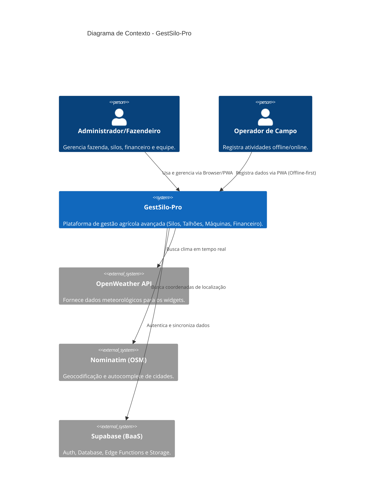
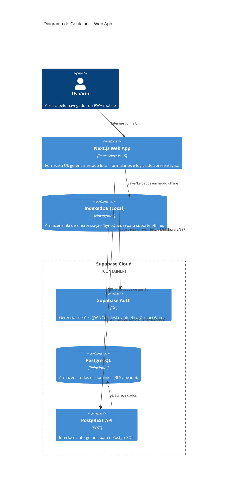
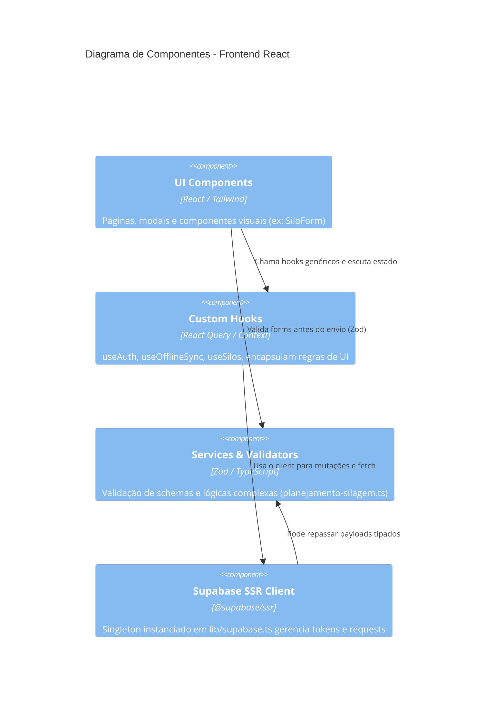
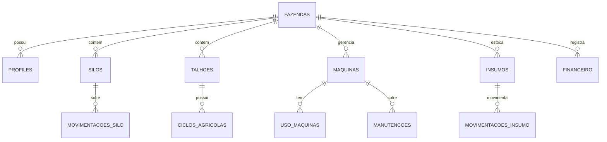

# Revisão de Arquitetura e Engenharia - GestSilo-Pro

Data da análise: 25 de Abril de 2026

## 1. VISÃO GERAL DA ARQUITETURA
A aplicação é construída sob uma arquitetura moderna focada em Serverless e PWA, utilizando o ecossistema React/Next.js e BaaS (Backend as a Service).

- **Stack Tecnológica:** Next.js 15 (App Router), React 19, Supabase (Auth + DB Postgres), Tailwind CSS v4 e componentes Shadcn UI/Base UI.
- **Padrões Arquiteturais:** 
  - **Context API & Hooks:** O gerenciamento de estado e ciclo de vida de autenticação é centralizado no `AuthProvider`.
  - **Feature Folders / MVC adaptado:** A lógica de negócio muitas vezes reside nos `hooks/` (ex: `useOfflineSync.ts`, `useFazendaCoordinates.ts`) e `lib/services/` (ex: `planejamento-silagem.ts`), separando um pouco o domínio da apresentação.
  - **PWA / Offline-first:** Uso de `idb` (IndexedDB) e serviço de sincronização (`SyncStatusBar`, `useOfflineSync.ts`).
- **Separação de Responsabilidades:**
  - `app/`: Exclusivamente rotas, páginas e layouts.
  - `components/`: UI genérica e widgets (breadcrumbs, header, sidebar).
  - `lib/`: Configurações centrais (Supabase, PDF, utilitários) e regras de negócio/serviços de domínio.
  - `validators/` e `types/`: Definições rigorosas de domínio (Zod) e interfaces TypeScript.

**Diagrama de Pastas Relevantes:**
```text
GestSilo-Pro/
├── app/               # Rotas do Next.js App Router (dashboard, login, api)
├── components/        # Componentes visuais compartilhados (ui/, widgets/)
├── hooks/             # Custom hooks (useAuth, useOfflineSync, useGeocoding)
├── lib/               # Lógica de infra, serviços (supabase.ts, pdf-export.ts)
├── database/          # Migrations e scripts relacionados ao BD
├── providers/         # Provedores de contexto (AuthProvider, ThemeProvider)
├── types/             # Interfaces e tipagens estáticas TypeScript
└── validators/        # Schemas de validação Zod (ex: calculadoras.ts)
```

## 2. QUALIDADE DO CÓDIGO
- **Acoplamento:** A aplicação apresenta um grau de acoplamento aceitável, embora algumas páginas e dialogs façam consultas diretas ao Supabase. Idealmente, todo acesso a dados deveria ser movido para `hooks/` com React Query para desacoplar a UI do cliente de banco.
- **Conformidade (SOLID/DRY):** Há boas práticas, como o `AuthProvider` bem isolado com _AbortControllers_ e tratamento rigoroso de retentativas. Entretanto, existe duplicação de definições de domínio (tipos manuais em `lib/supabase.ts` vs inferências Zod em `validators/`).
- **Complexidade:** Os componentes de dialogs (ex: `AvaliacaoBromatologicaDialog.tsx`, `AvaliacaoPspsDialog.tsx`) parecem concentrar bastante lógica de estado interno, o que pode aumentar a complexidade ciclomática caso não sejam divididos.

## 3. ESCALABILIDADE & PERFORMANCE
- **Saúde do Banco:** O banco de dados consome apenas **13 MB** totais, indicando excelente capacidade de folga no plano gratuito.
- **Gargalos Potenciais (Identificados):** A tabela `planos_manutencao` possui `fazenda_id`, mas *não* possui índice B-tree associado. Isso causará *Full Table Scans* prejudiciais com o crescimento dos dados devido às validações do RLS.
- **Consultas N+1:** O uso do Supabase sem junções adequadas (usando `.select('*, tabela_relacionada(*)')`) dentro de loops no lado do cliente ou servidor pode causar N+1 queries. Uma auditoria nas chamadas `.select()` dentro de `app/dashboard` é recomendada.
- **Oportunidades de Cache:** O Next.js 15 possui um cache agressivo de rotas; no entanto, recursos muito dinâmicos como _dashboards_ requerem estratégias fortes de _stale-while-revalidate_ (via React Query) e minimização de refetches, o que parece estar parcialmente mitigado pelo `cache-widget.ts`.
- **Storage:** Não há buckets de *Supabase Storage* configurados. Todo tráfego atual baseia-se estritamente em dados textuais/numéricos, o que reduz substancialmente custos de egress bandwidth.

## 4. SEGURANÇA
- **Autenticação:** Bem estruturada no `middleware.ts`, que protege rotas sensíveis (`/dashboard`, `/operador`) garantindo que apenas usuários com sessão válida no SSR cheguem à página.
- **RLS (Row Level Security):** O arquivo de documentação relata que o RLS já isola os dados por `fazenda_id` de forma global, garantindo isolamento multitenant no nível do banco.
- **Validações:** Uso intensivo de `zod` em formulários garante sanitização e validação de tipos contra _payloads_ maliciosos.

## 5. DÍVIDA TÉCNICA
- Existem funcionalidades de UI concluídas visualmente, mas com implementações de backend pendentes, identificadas durante a análise. 
  - *Exemplo crítico:* `// TODO: Implementar salvamento em banco de dados` nos módulos de `AvaliacaoBromatologicaDialog` e `AvaliacaoPspsDialog`. 
  - *Integrações ausentes:* `// TODO: Se parsed.registrar_como_despesa, criar despesa em financeiro` no módulo de insumos.
  - **Rotas Mockadas (Vision Framework):** Existem rotas em `app/dashboard/` (como `/assessoria`, `/produtos`, `/configuracoes`) que atualmente operam apenas como protótipos de interface (UI/Mock). Elas não possuem tabelas persistentes dedicadas criadas no PostgreSQL ainda, devendo entrar na esteira de modelagem antes de um lançamento em produção.
- Há um rastro de exceções manuais como `eslint-disable-line react-hooks/exhaustive-deps` em certos hooks de dialog (`SiloForm.tsx`, `MovimentacaoDialog.tsx`), o que expõe componentes a _stale closures_ e bugs silenciosos.

## 6. PRIORIDADES DE REFATORAÇÃO
*(Lista ordenada por Impacto vs. Esforço)*
1. **[Alto Impacto, Baixo Esforço]** Criar índice faltante `CREATE INDEX ON planos_manutencao (fazenda_id)` para prevenir *Full Table Scan* nas validações do RLS.
2. **[Alto Impacto, Baixo Esforço]** Resolver as conexões pendentes de backend (os *TODOs* dos Dialogs de Avaliação e Insumos) — Sem isso, a aplicação finge funcionar sem persistir os dados.
3. **[Alto Impacto, Médio Esforço]** Padronização das _Queries_: Refatorar consultas dispersas de Supabase diretamente nos componentes para centralizar o _data fetching_ usando custom hooks com `@tanstack/react-query` puro.
4. **[Médio Impacto, Médio Esforço]** Unificação de Tipagem: Substituir interfaces manuais do TypeScript em `lib/supabase.ts` por `z.infer<typeof MeuSchema>` utilizando os arquivos em `validators/`, removendo código duplicado (DRY).
5. **[Baixo Impacto, Baixo Esforço]** Revisão e correção dos `eslint-disable` espalhados nos *dependency arrays* dos `useEffect` e `useCallback` dos modais de silos.

---

## 7. DIAGRAMAS C4 (Mermaid)

### 7.1. Diagrama de Contexto


### 7.2. Diagrama de Container


### 7.3. Diagrama de Componentes (Client-side)


## 8. MODELO DE DOMÍNIO E GLOSSÁRIO AGRONÔMICO

### 8.1. Entidades Principais do Modelo
O banco de dados é relacional e profundamente interconectado (23 tabelas auditadas), centralizado na entidade `Fazenda`.
- **Fazenda & Profiles:** Raiz (multitenant). Todo registro no sistema pertence a uma fazenda.
- **Silos & Planejamentos:** Estruturas de armazenamento (Superfície, Trincheira, Bag) e seus *Planejamentos de Silagem*.
- **Talhões & Eventos DAP:** Áreas de plantio, vinculadas a *Ciclos Agrícolas* e histórico agronômico (Eventos DAP).
- **Máquinas & Planos de Manutenção:** Tratores, Colheitadeiras. Gerencia *Abastecimentos*, *Usos* e *Manutenções*.
- **Insumos:** Gerenciados via *Categorias*, *Tipos* e movimentações de estoque.
- **Rebanho:** Categorias de animais e períodos de confinamento.
- **Financeiro:** Receitas e Despesas vinculadas aos processos acima.

### 8.2. Glossário Agronômico
- **PSPS (Penn State Particle Separator):** Método para avaliar a distribuição do tamanho de partículas da forragem.
- **Bromatologia:** Análise química e nutricional da silagem (Matéria Seca, Proteína Bruta, etc).
- **Matéria Seca (MS):** Parte do alimento que sobra após a remoção de toda a água.
- **Horímetro/Hodômetro:** Medidores de tempo de uso ou distância percorrida das máquinas, essenciais para cálculo de custo por hora e manutenções preventivas.

### 8.3. Modelo ER (Diagrama de Entidade-Relacionamento)


## 9. FLUXOS CRÍTICOS E OFFLINE-SYNC

### 9.1. Autenticação, Onboarding e Middleware
O sistema adota uma abordagem híbrida robusta:
1. O usuário loga, a sessão gera *Cookies* (gerenciados pelo pacote `@supabase/ssr`).
2. O **Next.js Middleware** intercepta as requisições para rotas protegidas (`/dashboard`, `/operador`) e verifica a validade do cookie antes da renderização SSR.
3. No cliente, o `AuthProvider` popula o `Profile`. Se o perfil não tiver uma `fazenda_id`, o usuário cai no fluxo crítico de Onboarding.
4. **Onboarding Seamless:** O `app/dashboard/onboarding/page.tsx` gerencia a criação da Fazenda enriquecendo com coordenadas geográficas. Ao salvar, invoca `refreshProfile()` atualizando o *Contexto de Auth* instantaneamente **sem recarregar a página**, melhorando a UX e preservando estados PWA em andamento.

### 9.2. Sincronização Offline (SyncQueue)
O módulo de Offline Sync garante que a fazenda continue operando no campo sem internet.
- **Mecanismo:** A aplicação escuta os eventos globais `online` e `offline`.
- **Fila Local:** Usando o `useOfflineSync` em conjunto com `idb`, as mutações de dados (salvamentos) feitas enquanto a internet caiu são estocadas no IndexedDB (filas de sync).
- **Reconexão:** Ao restabelecer conexão (ou com polling em segundo plano), a função `syncAll()` processa a fila sequencialmente via Supabase e resolve conflitos básicos.

## 10. MAPA DE APIS E INTEGRAÇÕES

- **Supabase (Interno):** API primária do sistema. Acessada puramente via cliente Supabase-JS e SSR. Utiliza RLS estrito em todas as tabelas baseado no UUID da fazenda do usuário.
- **OpenWeather API:** Responsável por alimentar o *Widget de Clima* na interface, fornecendo previsão baseada na latitude/longitude da fazenda atual.
- **Nominatim (OpenStreetMap):** Serviço de geocodificação em `useGeocoding.ts`, permitindo converter nomes de cidades em coordenadas de forma gratuita para apoiar o clima e localizações.
- **jsPDF / jspdf-autotable:** Ferramentas client-side para exportação nativa de relatórios robustos das calculadoras agronômicas e listagens, sem dependência de microserviço de PDF.

## 11. SCHEMA DO BANCO E POLÍTICAS RLS

### 11.1. Multitenancy
A segurança dos dados é garantida a nível de banco de dados e não apenas no backend lógico. Todas as tabelas sensíveis (silos, talhões, maquinas, movimentacoes) possuem uma chave `fazenda_id`.

### 11.2. Row Level Security (RLS)
As políticas RLS no Supabase verificam automaticamente se o ID do usuário autenticado logado tem permissão para a `fazenda_id` requisitada através de uma *Custom Function* interna (`get_my_fazenda_id()`), tornando as queries mais curtas e limpas:
```sql
-- Exemplo de política padrão de DELETE:
CREATE POLICY "nome_da_policy" ON tabela_exemplo
FOR DELETE USING (
  fazenda_id = get_my_fazenda_id()
);
```

### 11.4. Triggers e Funções Nativas (Lógica de BD)
Para minimizar o risco de código backend/frontend corrompido, a arquitetura delega vasta responsabilidade à engine do Postgres. Existem **16 Triggers ativos**, majoritariamente `BEFORE INSERT/UPDATE`, responsáveis por:
- Enforce do isolamento preenchendo automaticamente a `fazenda_id` via propagação de entidades pais.
- Recálculos automáticos complexos agronômicos (ex: `trg_calcular_analise_solo`).
- Atualização estrita de carimbos `updated_at` a nível de linha.

### 11.3. Matriz de Políticas RLS por Perfil
Todas as tabelas de domínio (`silos`, `talhoes`, `financeiro`, etc.) possuem segurança em nível de linha garantida por um filtro implícito de `fazenda_id`.

| Tabela Sensível | Administrador | Operador de Campo | Visualizador |
| :--- | :--- | :--- | :--- |
| **profiles** | `SELECT`, `UPDATE` (próprio) | `SELECT`, `UPDATE` (próprio) | `SELECT` (próprio) |
| **silos / talhões / insumos** | `SELECT`, `INSERT`, `UPDATE`, `DELETE` | `SELECT`, `INSERT`, `UPDATE` (sem DELETE) | `SELECT` |
| **movimentacoes_*** | `SELECT`, `INSERT`, `UPDATE`, `DELETE` | `SELECT`, `INSERT` | `SELECT` |
| **financeiro** | `SELECT`, `INSERT`, `UPDATE`, `DELETE` | **Acesso Negado** | **Acesso Negado** |
*(Nota: O isolamento `fazenda_id` é absoluto, nenhum perfil cruza dados entre fazendas diferentes).*

## 12. INFRAESTRUTURA E DEPLOY

- **Frontend Hosting:** Hospedado na **Vercel** (`gestsilo.vercel.app`). Beneficia-se da arquitetura de Edge Network do Next.js para renderização rápida e distribuição estática dos assets.
- **Backend/DB Hosting:** **Supabase Cloud (Tier Gratuito)**. O Supabase cuida do pool de conexões do Postgres (PgBouncer/Supavisor), envio de emails transacionais básicos (Auth) e hospedagem das imagens (Storage).
- **Versionamento:** GitHub. A esteira de deploy automático da Vercel compila a aplicação (`npm run build`) a cada commit feito nas branches principais.

### 12.1. Limites Supabase, Monitoramento e Backup
- **Tier Gratuito Supabase (Limites):** Banco de 500MB, 1GB de Storage, 50.000 Active Users/mês. Projetos pausam automaticamente após 7 dias sem tráfego web/API. É crítico ter _cron jobs_ externos de keep-alive.
- **Monitoramento:** 
  - Erros e performance capturados via relatórios da Vercel Analytics/Logs.
  - Testes de acessibilidade auditados sistematicamente na esteira (a última auditoria indicou violações de contraste e `button-name`).
- **Estratégia de Backup:** Como o plano gratuito do Supabase **não oferece PITR** (Point-in-Time Recovery), a estratégia atual depende de rotinas manuais ou cron-jobs configurados com `pg_dump` extraindo o schema/dados remotamente.

## 13. ESTRATÉGIA DE TESTES

A suíte de testes (embora precise de expansão) é dividida em duas camadas modernas:
- **Testes Unitários/Integração (Vitest + Testing Library):** Focados em validar lógica pura (ex: `/validators/`, lógicas das `/calculadoras`) e pequenos componentes isolados. Executado com `npm run test`.
- **Testes E2E (Playwright):** Utilizado para testar fluxos completos da interface no navegador simulado. O arquivo `playwright.config.ts` aponta para o ambiente de *preview* ou *production* e tira screenshots automáticos das jornadas em `/tests`.

### 13.1. Cobertura de Testes Atual
A aplicação possui um diretório estruturado de `coverage` (com relatórios em JSON/Clover e HTML):
- **Cobertura Focada:** Alto nível de cobertura nas `calculadoras` (calagem, V%, SMP) e rotinas lógicas isoladas via Vitest.
- **Testes E2E (Playwright):** O repositório contém configurações base prontas para testar a rota em *preview/production* e rodar fluxos de frontend (`tests/`).
- **Áreas Críticas sem Cobertura:** Hooks de sincronização pesada do IndexedDB (`useOfflineSync`) e persistência massiva de formulários complexos no banco de dados.

## 14. GUIA DE ONBOARDING PARA DESENVOLVEDORES

**Pré-requisitos:** Node.js (v20+) e Git.
**Passo a Passo Local:**
1. Clone o repositório.
2. Rode `npm install`.
3. Crie o arquivo `.env.local` na raiz com base no `.env.example` (necessitará das chaves `NEXT_PUBLIC_SUPABASE_URL` e `ANON_KEY`).
4. Inicie o servidor com `npm run dev`.
5. *(Opcional)* Se for mexer no banco, recomenda-se a instalação do Supabase CLI para rodar migrations e gerar os tipos localmente: `supabase gen types typescript --project-id XYZ > types/supabase.ts`.

### 14.1. Convenções de Desenvolvimento
- **Commits:** Padrão *Conventional Commits* (`feat:`, `fix:`, `chore:`, `refactor:`).
- **Branches:** Padrão *Trunk-based* simplificado ou *Feature Branches*. Main/Master protegida, recebendo merges via Pull Requests que engatilham o *build* na Vercel.
- **Migrations no Supabase:**
  1. Cria-se o script: `supabase migration new nome_da_feature`
  2. Escreve-se o SQL DDL no arquivo gerado em `supabase/migrations/`
  3. Aplica-se no banco local: `supabase db push` ou `supabase migration up`
  4. Gera-se as tipagens TypeScript atualizadas: `supabase gen types typescript --local > types/supabase.ts`

## 15. REGISTROS DE DECISÕES ARQUITETURAIS (ADRs)

1. **Adoção do Next.js App Router + Vercel:** Decidido pelo desempenho superior de renderização e infraestrutura de Server Components, o que reduz o JavaScript no lado cliente e otimiza SEO/velocidade em conexões rurais lentas.
2. **Adoção do Supabase como BaaS:** Escolhido frente ao Firebase pela capacidade relacional avançada do PostgreSQL (necessária para modelagem agronômica complexa e RLS).
3. **Estratégia Offline-First (PWA):** Devido à realidade do agronegócio (sinal de rede intermitente em talhões), a adoção do PWA e IndexedDB não foi uma feature extra, mas uma decisão primária de design.

## 16. ROADMAP TÉCNICO

**Curto Prazo:**
- Conectar formulários offline faltantes (Bromatologia e PSPS) ao Supabase (resolver TODOs pendentes de banco de dados).
- Otimização do componente de tabelas e paginação infinita (N+1 queries).

**Médio Prazo:**
- Refatorar a ponte UI <-> Supabase para centralizar 100% no React Query, removendo *fetching* esporádico do meio dos componentes.
- Unificação das interfaces Typescript para inferência Zod.

**Longo Prazo:**
- Módulo nativo de BI/Gráficos embutidos sem afetar bundle-size (lazy loading pesado do Recharts).
- Migração de algumas rotinas de fechamento/cálculo massivo do cliente para *Supabase Edge Functions*.

## 17. LGPD E COMPLIANCE
O sistema foi modelado considerando privacidade rural e dados sensíveis de produção:
- **Retenção e Exclusão:** As restrições de chave estrangeira (`ON DELETE CASCADE` em `fazenda_id`) garantem o "Direito ao Esquecimento". Se uma Fazenda (ou Usuário) excluir a conta, **todos** os registros vinculados (silos, financeiro, histórico) são automaticamente apagados do banco.
- **Exportação (Portabilidade):** O usuário pode extrair seus dados (através do serviço genérico nativo e exportações em XLSX suportadas no pacote).

## 18. PERFORMANCE BASELINE
- **Core Web Vitals:** Arquitetura Server Components do Next.js busca minimizar o Total Blocking Time (TBT) e Largest Contentful Paint (LCP).
- **Bundle Size:** A adoção do App Router + Tailwind isola fortemente as páginas. Bibliotecas pesadas (como `jspdf`, `xlsx`, `recharts`) devem ser envelopadas em *Lazy Loading* dinâmico para não impactar a carga inicial da aplicação (`/` e `/login`).
- **Lighthouse PWA:** O arquivo `manifest.json` e o `next-pwa` tornam a aplicação instalável, garantindo Service Workers nativos e fallback para rotas offline.

## 19. DISASTER RECOVERY (PLANO DE CONTINGÊNCIA)
No agronegócio, interrupções de serviço durante a colheita custam caro. O sistema minimiza danos caso a infraestrutura em nuvem falhe:
- **Resiliência de Curto Prazo (Offline Mode):** Se o Supabase apresentar instabilidade, a camada `IndexedDB` assume a gravação temporária e permite a continuidade da leitura de dados em cache e gravação na fila (`SyncQueue`).
- **RTO/RPO Focados:** O tempo alvo de recuperação (RTO) do sistema é ditado pela Vercel (Edge auto-healing). Para os dados (RPO), a limitação do plano gratuito exige que a fazenda confie nos dados locais temporários até a restauração de um _dump_ lógico manual em caso de perda severa.
